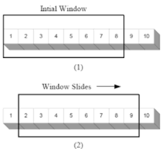

# Sliding Window Pattern

`Example: Given an array, find the average of all contiguous subarrays of size 'K' in it`
    
 **Sample input:**
`    Array[1,3,2,6,-1,4,1,8,2], K=5`

## **Algorithm steps (Brute Force):**
    * For every subarray of length K
      * calculate the sum of subarray
          * divide by K and add result to array
        
    
    1. For first 5 numbers (index 0-4)
    average = (1+3+2+6-1)/5 = 2.2

    2. (3+2+6-1+4)) = 2.8

    3. ...
    
`Output: [2.2, 2.8, 2.4, 3.6, 2.8]`

### bruteforce.java

    import java.util.Arrays;

    class AverageOfSubarrayOfSizeK {
    public static double[] findAverages(int K, int[] arr){
        double[] result = new double[arr.length - K + 1];
        for (int i =0;i<= arr.length - K; i++){
            //find sum of next 'K' elements
            double sum = 0;
            for (int j = i; j<i+K;j++) //start at index i; sum next K elements 
                sum+=arr[j];
            result[i] = sum/K;

        }
        return result;
    }

    public static void main(String[] args) {
        double[] result = AverageOfSubarrayOfSizeK.findAverages(5, new int[] { 1,2,3,4,5,6,7,8,9,10 });
        System.out.println("Averages of subarrays of size K: " + Arrays.toString(result));
    }
    }
 
    
    
**Time Complexity**: O(N*K)
  - for every element, we are calculating the sum of its next 'K' elements
  - inefficient, any two consecutive arrays of length 5 will have 3 overlapping values
    - can we preserve these values without doing the calculation every time?

## **Algorithm Steps (Sliding Window solution)**
  * Sum the first K elements
    * divide by K
      * Add sum to result array A
  * for every element in A
    * subtract the edge going out (left)
    * add the edge going in (right)
    

**findAverages**
  public static double[] findAverages(int K, int[] arr){
    double[] result = new double[arr.length - K + 1];
    double windowSum = 0;
    int windowStart=0;

    for(int windowEnd = 0;windowEnd<arr.length;windowEnd++){
        windowSum+=arr[windowEnd]; //add the next element
        //slide the window; only start adding to result array until we reach K elements (window is big enough)
        if(windowEnd >= K-1){
            result[windowStart] = windowSum/K;
            windowSum -= arr[windowStart];
            windowStart++;
            }

        }
    return result;
    }

    
**Time Complexity**: O(N)

    

    
    